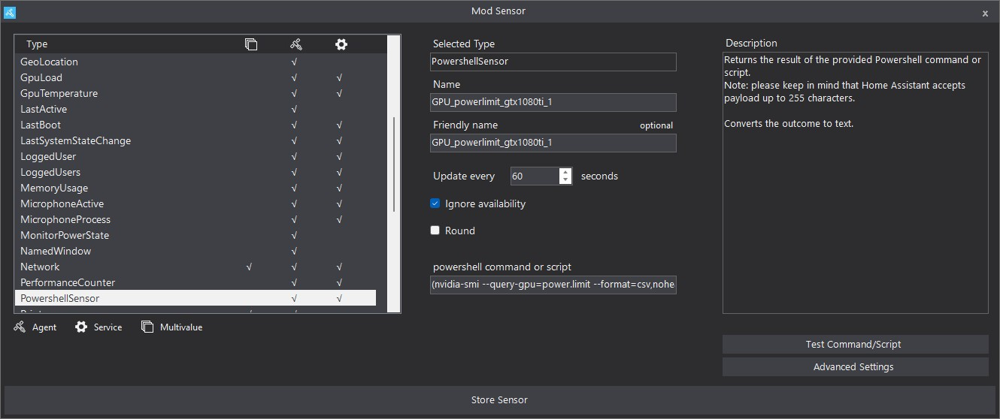

# Smart Power-Aware Mining Rig with Home Assistant and Windows

This project describes a fully automated mining rig that operates GPUs based on surplus solar power. The setup combines:

- A **Windows 11 mining rig** with NVIDIA GPUs and GMiner
- **HASS.Agent** for command/control and monitoring
- **Home Assistant** for solar-aware logic and automation

> The system ensures that mining only occurs when conditions allow, such as sufficient battery charge, available photovoltaic (PV) power, and low competing load priority.

> The example is based on 6 available GPUs. However, the logic is repetitive.

---

## Step 1: Mining Rig Setup (Windows 11)

The mining rig runs **Windows 11** and uses **GMiner** for mining (e.g., Ravencoin). It includes one `.bat` file per GPU and is controlled externally via Home Assistant.

### Folder Structure

All files are placed inside:

```
C:\Mining\GMiner\
├── miner.exe
├── mine_ravencoin_0.bat
├── mine_ravencoin_1.bat
├── ...
├── mine_ravencoin_x.bat
├── set_power_limit.bat
```

### Setting GPU Power Limits at Boot

To ensure GPUs always run with the correct power limits, the file `set_power_limit.bat` is executed during system startup using Windows Task Scheduler. This batch script applies power limits via `nvidia-smi` and GPU UUIDs.

#### Example: `set_power_limit.bat`

```bat
@echo off
title Set NVIDIA Power Limits
:: GPU0
nvidia-smi -i GPU-<UUID> -pl 210
:: GPU1
nvidia-smi -i GPU-<UUID> -pl 210
```

#### Registering the Task at Boot

Run this one-liner in an elevated Command Prompt:

```bat
schtasks /create /tn "SetNvidiaPL" /tr "C:\Mining\set_power_limit.bat" /sc onstart /ru "SYSTEM" /rl HIGHEST
```

#### Verify Settings

```bat
nvidia-smi --query-gpu=name,power.limit --format=csv
```

### Batch Files for Mining

Each GPU is controlled via its own `.bat` file. They define the miner executable, pool, wallet, and device index.

#### Sample: `mine_ravencoin_sample.bat`

```bat
title GMiner_GPU<ID>
cd "C:\Mining\GMiner\"
miner.exe --algo kawpow --server [YOUR_POOL_ADDRESS] --user [YOUR_WALLET].[YOUR_WORKER_ID] --devices GPU<ID>
pause
```

- Each file uses a distinct `--devices` number and `title` for tracking
- All batch files remain in the miner directory

For advanced setups, the GPU `UUID` can be mapped to GMiner indices. This ensures deterministic GPU selection when multiple models are present.

#### Example: `mine_ravencoin_0.bat`

```bat
@echo off
setlocal ENABLEDELAYEDEXPANSION
title GMiner_GPU0

REM ====== Enter your UUID(s) here ======
set "UUID_LIST=GPU-<UUID1>"
REM Example for multiple:
REM set "UUID_LIST=GPU-<UUID1>,GPU-<UUID2>"

set "DEVICE_INDICES="

REM ====== UUID -> INDEX mapping for 'nvidia-smi -L' ======
for %%U in (%UUID_LIST%) do (
  set "IDX_FOUND="
  for /f "usebackq tokens=2 delims= " %%I in (`
    nvidia-smi -L 2^>nul ^| find "%%~U"
  `) do (
    set "IDX_TMP=%%I"
    set "IDX_FOUND=!IDX_TMP::=!"
  )
  if defined IDX_FOUND (
    if defined DEVICE_INDICES (
      set "DEVICE_INDICES=!DEVICE_INDICES!,!IDX_FOUND!"
    ) else (
      set "DEVICE_INDICES=!IDX_FOUND!"
    )
  ) else (
    echo [ERROR] UUID %%~U could not be found
    echo [DEBUG]output of 'nvidia-smi -L':
    nvidia-smi -L
    pause
    exit /b 1
  )
)

echo [INFO] UUID(s): %UUID_LIST%
echo [INFO] GMiner-Indices: %DEVICE_INDICES%

REM ====== Overview and check ======
nvidia-smi -L
nvidia-smi --query-gpu=index,uuid,name,pci.bus_id --format=csv 2>nul

REM ====== Start GMiner ======
cd /d C:\Mining\GMiner
miner.exe --algo kawpow --server rvn.2miners.com:6060 --user [YOUR_WALLET_ADDRESS].[YOUR_WORKER_ID] --devices %DEVICE_INDICES%

echo [INFO] Mining ended
pause
```

---

## Step 2: HASS.Agent Integration on Windows Rig

### Access Configuration

- A **long-lived access token** is created in Home Assistant and entered into HASS.Agent
- MQTT uses existing `mosquitto` broker credentials
- Ensure all commands and sensors run with **"Run as low integrity"** enabled

### Commands Setup (from `commands.json`)

Each GPU has its own start/stop command in HASS.Agent.

#### Start GPU0:

```json
{
  "Name": "Mining-Rig-1-Start-GPU0",
  "Command": "C:\\Mining\\GMiner\\mine_ravencoin_0.bat",
  "RunAsLowIntegrity": true
}
```

#### Stop GPU0:

```json
{
  "Name": "Mining-Rig-1-Stop-GPU0",
  "Command": "taskkill /f /fi \"WindowTitle eq  GMiner_GPU0\" /t",
  "RunAsLowIntegrity": true
}
```

The same pattern is used for GPU1 through GPU5, with only the device number and window title changing.

#### Graphical Setup Examples:

**Start GPU0 Command Setup**


This shows how HASS.Agent is configured to start GPU0 by executing the batch file `mine_ravencoin_0.bat`. The "Run with low integrity" option is checked to allow execution without elevated privileges.

**Stop GPU0 Command Setup**


This shows the HASS.Agent stop command for GPU0, which uses a `taskkill` command targeting the window title of the GPU miner process.

---

## Step 3: GPU Status Monitoring via HASS.Agent Sensors

### Window Detection (from `sensors.json`)

Each GPU has a `NamedWindowSensor` to detect whether the corresponding miner process is running.

#### Example: GPU0

```json
{
  "Type": "NamedWindowSensor",
  "Name": "GMiner_GPU0_active",
  "WindowName": "GMiner_GPU0",
  "UpdateInterval": 5
}
```

These sensors are auto-discovered in Home Assistant as `binary_sensor.mining_rig_1_gminer_gpux_active`.

#### Graphical Setup Example:


This shows the sensor configuration in HASS.Agent. It tracks if a Command Prompt window with the title `GMiner_GPU0` is open (not necessarily in focus).

### Power Limit Tracking (from `sensors.json`)

Each GPU has a `PowershellSensor` to detect current power limit of that GPU.

#### Example: GPU0

```json
  {
    "Type": "PowershellSensor",
    "Id": "<UUID>",
    "Name": "GPU_powerlimit_<graphic-card>",
    "UpdateInterval": 60,
    "Query": "(nvidia-smi --query-gpu=power.limit --format=csv,noheader,nounits -i GPU-<UUID>).Trim()",
    "Scope": null,
    "WindowName": "",
    "Category": "",
    "Counter": "",
    "Instance": "",
    "EntityName": "GPU_powerlimit_<graphic-card>",
    "IgnoreAvailability": true,
    "ApplyRounding": false,
    "Round": null,
    "AdvancedSettings": null
  },
```

These sensors are auto-discovered in Home Assistant as `sensor.GPU_powerlimit_<graphic-card>`.

#### Graphical Setup Example:



This shows the sensor configuration in HASS.Agent.


### Final HASS.Agent Setup:


This shows the sensors configuration in HASS.Agent after the setup.


This shows the commands configuration in HASS.Agent after the setup.


This shows the commands and sensors configuration in Home Assistant after the setup.

---

## Step 4: Power Logic Calculation in Home Assistant

Two Home Assistant template sensors determine system capability:

The first sensor (`possible_gpus`) calculates how many GPUs can be powered based on grid power, solar power, battery SOC, and the status of a priority consumer. If conditions are favorable, it estimates how many GPUs could be run without drawing energy from the grid.

The second sensor (`active_gpus`) simply counts how many GPUs are currently active, using HASS.Agent window sensors that detect running miner windows.

By comparing both values, the system can decide when to start or stop mining GPUs.

Replace (`[YOUR_...]`) with the appropriate value of your system.

### Sensor: `possible_gpus`

```yaml
- sensor:
    - name: "possible_gpus"
      unique_id: 5b9b247f-490b-4638-937b-2de8eeea4b8a
      icon: mdi:expansion-card
      state: >-
        
        
        
        
        

        
        
        
        
        
        
        
        
    
        
        
        

        
        
        

        
          
          
        
          
        
        
        
        
          
            
              
                
                  
                  
                
              
              
            
              
              
                
                  
                  
                
              
              
            
              
              
                
                  
                  
                
              
              
            
              
            
          
            
          
        
          
        
        
          
        
        
          
        
        {{ gpus }}
```

### Sensor: `active_gpus`

```yaml
- sensor:
    - name: "active_gpus"
      unique_id: cfadd956-b245-4e1c-a0af-7a890e83dcdd
      icon: mdi:expansion-card-variant
      state: >
        
        
        
        
        
        
        
        
        
          
        
        
          
        
        
          
        
        
          
        
        
          
        
        
          
        
        
        
          
        
        {{ gpus }}
```

### Sensor: `Mining Rig online`

```yaml
- binary_sensor:
    - name: "[YOUR_MINING_RIG_ONLINE_SENSOR]"
      unique_id: 2e916f8b-16cc-4d58-becd-a767ae00b8c3
      state: >-
        
        
          
          
          {{ s not in ['unknown','unavailable', None] and age < 20 }}
        
          false
        
      availability: >
        {{ true }}
```

---

## Step 5: Automation – Dynamic GPU Start/Stop

This automation starts or stops mining GPUs depending on the comparison of `possible_gpus` and `active_gpus`.

```yaml
alias: Miningmanagement
```
[... see automations.yaml ...]


> ⚠️ The full action block includes one-by-one conditional logic for each GPU, using `button.press` and 15-second delays between steps.

---

## Step 6: Additional Sensors and Monitoring Tools

#### Local Rig IP address

```json
  {
    "Type": "PowershellSensor",
    "Id": "7b7d35a4-d3c3-4f02-92d5-2c3c995628a0",
    "Name": "local_IP",
    "UpdateInterval": 60,
    "Query": "(Get-NetIPAddress -AddressFamily IPv4 -InterfaceIndex ((Get-NetRoute -AddressFamily IPv4 -DestinationPrefix '0.0.0.0/0' | Sort-Object RouteMetric, InterfaceMetric | Select-Object -First 1).InterfaceIndex) | Where-Object { $_.IPAddress -notlike '169.*' -and $_.IPAddress -notlike '127.*' } | Select-Object -First 1 -ExpandProperty IPAddress)",
    "Scope": null,
    "WindowName": "",
    "Category": "",
    "Counter": "",
    "Instance": "",
    "EntityName": "local_IP",
    "IgnoreAvailability": false,
    "ApplyRounding": false,
    "Round": null,
    "AdvancedSettings": null
  }
```

This sensor gets the local IP of the Mining Rig.

#### Hashrate of each GPU

To obtain the current hashrate of each GPU the API option of the GMiner needs to be enabled (`--api`) and the port specified. If you use cascading GPU activation you will need to specify an individual port for each GPU.

```bat
miner.exe --algo kawpow --server [YOUR_POOL_ADDRESS] --user [YOUR_WALLET].[YOUR_WORKER_ID] --devices GPU<ID> --api [YOUR_PORT]
```

The inforamtion can be parsed via json either via the HASS.Agent or a RESTful sensor in HomeAssistant.

##### Hashrate via HASS.Agnet

A Powershell script reads the current hashrate and returns the value.

```powershell
param(
  [string]$lhost   = '127.0.0.1',
  [int]$lport      = 10050,
  [string]$WsPath = $null   # optional: z.B. '/ws' wenn bekannt
)

# ---- Hilfsfunktion: Zahl aus JSON "mhs" finden ----
function Find-MhsValue($obj) {
  if ($null -eq $obj) { return $null }
  if ($obj -is [double] -or $obj -is [float] -or $obj -is [int]) { return $obj }
  if ($obj -is [string]) {
    if ($obj -match '^[0-9]+([\.,][0-9]+)?$') { return [double]($obj -replace ',', '.') }
    return $null
  }
  if ($obj.PSObject) {
    foreach($p in $obj.PSObject.Properties){
      $n = $p.Name.ToLower()
      if($n -match 'mhs$|mh_s$|mhps$|mh'){
        $v = Find-MhsValue $p.Value
        if($null -ne $v){ return $v }
      }
    }
    foreach($p in $obj.PSObject.Properties){
      $v = Find-MhsValue $p.Value
      if($null -ne $v){ return $v }
    }
  }
  if ($obj -is [System.Collections.IEnumerable]) {
    foreach($i in $obj){ $v = Find-MhsValue $i; if($null -ne $v){ return $v } }
  }
  return $null
}

$base = "http://$lhost`:$lport"
$mh = 0.0

# ---- 1) Versuche /api (JSON) ----
try {
  $r = Invoke-WebRequest -Uri "$base/api" -UseBasicParsing -TimeoutSec 4
  if ($r.StatusCode -eq 200 -and $r.Content) {
    try {
      $j = $r.Content | ConvertFrom-Json -ErrorAction Stop
      $cand = @($j.total_speed.mhs,$j.total_hashrate.mhs,$j.speed.mhs,$j.hashrate.mhs) |
              Where-Object { $_ -ne $null } | Select-Object -First 1
      if ($cand -ne $null) { $mh = [double]$cand }
      if ($mh -eq 0) {
        $any = Find-MhsValue $j
        if($any -ne $null){ $mh = [double]$any }
      }
    } catch {}
  }
} catch {}

# ---- 2) /stat (Text) ----
if ($mh -eq 0) {
  try {
    $t = Invoke-WebRequest -Uri "$base/stat" -UseBasicParsing -TimeoutSec 4
    if ($t.StatusCode -eq 200 -and $t.Content -match '(?i)(?:total[_\s]*speed|mhs)\D*([0-9\.,]+)') {
      $mh = [double](($matches[1] -replace ',', '.'))
    }
  } catch {}
}

# ---- 3) HTML (Total oder GPU0) ----
if ($mh -eq 0) {
  try {
    $h = Invoke-WebRequest -Uri "$base/" -UseBasicParsing -TimeoutSec 4
    if ($h.StatusCode -eq 200 -and $h.Content) {
      $c = $h.Content
      if ($c -match '(?i)Total\s*Speed[^\r\n]*?([0-9\.,]+)\s*M\s*H/?s') {
        $mh = [double](($matches[1] -replace ',', '.'))
      } elseif ($c -match '(?i)GPU\s*0[^\r\n]*?([0-9\.,]+)\s*M\s*H/?s') {
        $mh = [double](($matches[1] -replace ',', '.'))
      }
    }
  } catch {}
}

# ---- 4) WebSocket (PowerShell 7) ----
if ($mh -eq 0) {
  # a) WS-URL bestimmen
  $wsUrl = $null
  if ($WsPath) {
    $wsUrl = ($WsPath.StartsWith('ws') ? $WsPath : "ws://$lhost`:$lport$WsPath")
  } else {
    # aus script.js lesen
    try {
      $js = Invoke-WebRequest -Uri "$base/script.js" -UseBasicParsing -TimeoutSec 4
      $code = $js.Content
      $reNewWS = @'
(?i)new\s+WebSocket\s*\(\s*(['"])([^'"]+)\1
'@
      $m = [regex]::Matches($code, $reNewWS)
      if ($m.Count -gt 0) {
        $arg = $m[0].Groups[2].Value
        if     ($arg.StartsWith('ws')) { $wsUrl = $arg }
        elseif ($arg.StartsWith('/'))  { $wsUrl = "ws://$lhost`:$lport$arg" }
      }
      if (-not $wsUrl) {
        $reAbs = @'
(?i)wss?://[^\s'"()]+
'@
        $m2 = [regex]::Matches($code, $reAbs)
        if ($m2.Count -gt 0) { $wsUrl = $m2[0].Value }
      }
      if (-not $wsUrl) {
        $reConcat = @'
(?i)wss?://\s*\+\s*location\.host\s*\+\s*(['"])(/[^'"]+)\1
'@
        $m3 = [regex]::Matches($code, $reConcat)
        if ($m3.Count -gt 0) { $wsUrl = "ws://$lhost`:$lport" + $m3[0].Groups[2].Value }
      }
    } catch {}
    if (-not $wsUrl) {
      foreach($p in '/ws','/socket','/api/ws','/stats','/telemetry','/miner'){
        $wsUrl = "ws://$lhost`:$lport$p"; break
      }
    }
  }

  try {
    Add-Type -AssemblyName System.Net.WebSockets
    $cs  = [System.Net.WebSockets.ClientWebSocket]::new()
    $cts = [System.Threading.CancellationTokenSource]::new()
    $cts.CancelAfter(4000)
    $cs.ConnectAsync([Uri]$wsUrl, $cts.Token).Wait()

    $rcs = [System.Threading.CancellationTokenSource]::new()
    $rcs.CancelAfter(4000)
    $buf = New-Object byte[] 65536
    $seg = [System.ArraySegment[byte]]::new($buf,0,$buf.Length)
    $sb  = [System.Text.StringBuilder]::new()

    do {
      $res = $cs.ReceiveAsync($seg, $rcs.Token).Result
      if ($res.Count -gt 0) {
        $chunk = [System.Text.Encoding]::UTF8.GetString($buf,0,$res.Count)
        [void]$sb.Append($chunk)
      }
    } while (-not $res.EndOfMessage)

    $text = $sb.ToString()

    # JSON probieren
    try {
      $trim = $text.TrimStart()
      if ($trim.StartsWith('{') -or $trim.StartsWith('[')) {
        $j = $text | ConvertFrom-Json -ErrorAction Stop
        $cand = @($j.total_speed.mhs,$j.total_hashrate.mhs,$j.speed.mhs,$j.hashrate.mhs) |
                Where-Object { $_ -ne $null } | Select-Object -First 1
        if ($cand -ne $null) { $mh = [double]$cand }
        if ($mh -eq 0) {
          $any = Find-MhsValue $j
          if($any -ne $null){ $mh = [double]$any }
        }
      }
    } catch {}

    # „MH/s“ im Text
    if ($mh -eq 0) {
      $mhs = [regex]::Matches($text, '(?i)([0-9\.,]+)\s*M\s*H/?s')
      if ($mhs.Count -gt 0) { $mh = [double](($mhs[$mhs.Count-1].Groups[1].Value -replace ',', '.')) }
    }
  } catch {}
}

# ---- Ausgabe ----
if ($mh -lt 0) { $mh = 0 }
[System.Globalization.CultureInfo]::CurrentCulture = 'en-US'
'{0:N2}' -f $mh

```

The script uses the WebSocket which is natively supported bei Powershell Version +7.x. Installation may be required. During installation, add pwsh to PATH.

```json
  {
    "Type": "PowershellSensor",
    "Id": "10b03bb5-c4ff-4410-9b35-838b57abc91f",
    "Name": "gpu0_gminer_hashrate",
    "UpdateInterval": 10,
    "Query": "& 'C:\\Program Files\\PowerShell\\7\\pwsh.exe' -NoLogo -NoProfile -ExecutionPolicy Bypass -File 'C:\\Mining\\scripts\\gminer_hashrate.ps1' -lport 10050 -WsPath '/ws'",
    "Scope": null,
    "WindowName": "",
    "Category": "",
    "Counter": "",
    "Instance": "",
    "EntityName": "gpu0_gminer_hashrate",
    "IgnoreAvailability": false,
    "ApplyRounding": false,
    "Round": null,
    "AdvancedSettings": null
  }
```

This Powershell sensor returns the current hasrate fromeach GPU. Note: The Port  (`lport [YOUR_PORT]`) reflects the GPU.

##### Hashrate via Home Assistant

In Homeassistant the hashrate can be obtained via a rest-sensor. Note: it will become "unavailable" when the GMiner is not running.

```yaml
rest:
  - resource_template: "http://[YOUR_MINING_RIG_IP]:[YOUR_PORT]/stat"
    scan_interval: 30
    timeout: 10
    headers:
      Accept: application/json
    sensor:
      - name: gpu[NUMBER]_gminer_hashrate
        unique_id: fcdd3de5-5f13-47fa-a6b7-593aae5488e1
        unit_of_measurement: "MH/s"
        state_class: measurement
        value_template: >-
          
            
            
             {{ (speed / 1e6) | round(2) }}
             {{ (speed / 1e3) | round(2) }}
             {{ (speed)       | round(2) }}
             {{ (speed * 1e3) | round(2) }}
            
            {{ (speed / 1e6) | round(2) }}
            
          
            0
          
```

Similary to the HASS.Agent sensor this RESTful sensor reads the API enabled port of the GMiner (`--api [YOUR_PORT]`).

#### GPU Temperature readout (NVIDIA)

```json
  {
    "Type": "PowershellSensor",
    "Id": "d01e9613-8786-43f4-9e43-aed682bc5b00",
    "Name": "GPU_temperature_[YOUR_GPU]",
    "UpdateInterval": 10,
    "Query": "( & \"C:\\Windows\\System32\\nvidia-smi.exe\" -i GPU-<UUID> --query-gpu=temperature.gpu --format=csv,noheader,nounits ).Trim()",
    "Scope": null,
    "WindowName": "",
    "Category": "",
    "Counter": "",
    "Instance": "",
    "EntityName": "GPU_temperature_[YOUR_GPU]",
    "IgnoreAvailability": false,
    "ApplyRounding": false,
    "Round": null,
    "AdvancedSettings": null
  }
```

This sensor reads the current GPU tempaerature. Note that the query is made to the specific `GPU-<UUID>`.

#### GPU Load readout (NVIDIA)

```json
  {
    "Type": "PowershellSensor",
    "Id": "94131152-cfd3-42c5-93d9-72def78330b8",
    "Name": "GPU_load_[YOUR_GPU]",
    "UpdateInterval": 10,
    "Query": "( & \"C:\\Windows\\System32\\nvidia-smi.exe\" -i GPU-<UUID> --query-gpu=utilization.gpu --format=csv,noheader,nounits ).Trim()",
    "Scope": null,
    "WindowName": "",
    "Category": "",
    "Counter": "",
    "Instance": "",
    "EntityName": "GPU_load_[YOUR_GPU]",
    "IgnoreAvailability": false,
    "ApplyRounding": false,
    "Round": null,
    "AdvancedSettings": null
  }
```

This sensor reads the current GPU load. Note that the query is made to the specific `GPU-<UUID>`.

---

## Summary

This project allows:

- Automated, energy-efficient GPU mining
- Tight integration with real-time PV and battery metrics
- Granular GPU control and feedback
- Fully modular and reproducible setup

This project is "as is" and will not be maintained.

---

Feel free to fork and customize the logic, or open issues for improvements or questions.

## Credits

- [Home Assistant](https://www.home-assistant.io/)
- [HASS.Agent](https://github.com/LAB02-Research/HASS.Agent)
- [ChatGPT](https://ChatGPT.com)