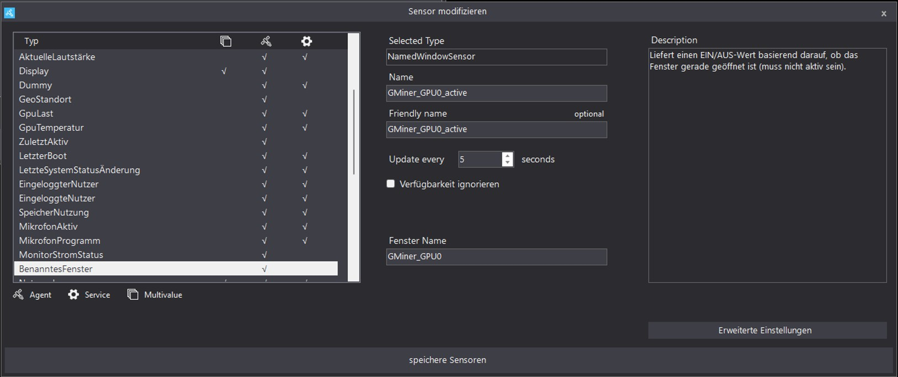

# Smart Solar-Aware Mining Rig with Home Assistant and Windows

This project describes a fully automated mining rig that operates GPUs based on surplus solar power. The setup combines:

- A **Windows 11 mining rig** with NVIDIA GPUs and GMiner
- **HASS.Agent** for command/control and monitoring
- **Home Assistant** for solar-aware logic and automation

> The system ensures that mining only occurs when conditions allow, such as sufficient battery charge, available photovoltaic (PV) power, and low competing load priority.

---

## Step 1: Mining Rig Setup (Windows 11)

The mining rig runs **Windows 11** and uses **GMiner** for mining (e.g., Ravencoin). It includes one `.bat` file per GPU and is controlled externally via Home Assistant.

### Folder Structure

All files are placed inside:

```
C:\Mining\GMiner\
├── miner.exe
├── mine_ravencoin_0.bat
├── mine_ravencoin_1.bat
├── ...
├── mine_ravencoin_x.bat
```

### Batch File Example (`mine_ravencoin_0.bat`)

```bat
cd "C:\Mining\GMiner\"
title GPU0 Miner
miner.exe --algo kawpow --server [YOUR_POOL_ADDRESS] --user [YOUR_WALLET].[YOUR_WORKER_ID] --devices 0
pause
```

- Each file uses a distinct `--devices` number and `title` for window tracking
- All batch files remain in the same directory as the miner executable

---

## Step 2: HASS.Agent Integration on Windows Rig

### Access Configuration

- A **long-lived access token** is created in Home Assistant and entered into HASS.Agent
- MQTT uses existing `mosquitto` broker credentials
- **All commands and sensors run with "Run as low integrity" enabled**

### Commands Setup (from `commands.json`)

Each GPU has its own start/stop command in HASS.Agent.

#### Start GPU0:

```json
{
  "Name": "Mining-Rig-1-Start-GPU0",
  "Command": "C:\Mining\GMiner\mine_ravencoin_0.bat",
  "RunAsLowIntegrity": true
}
```

#### Stop GPU0:

```json
{
  "Name": "Mining-Rig-1-StopGPU0",
  "Command": "taskkill /f /fi \"WindowTitle eq  GMiner_GPU0\" /t",
  "RunAsLowIntegrity": true
}
```

The same pattern is used for GPU1 through GPU5, with only the device number and window title changing.

#### Graphical Setup Examples:

**Start GPU0 Command Setup**


This shows how HASS.Agent is configured to start GPU0 by executing the batch file `mine_ravencoin_0.bat`. The "Run with low integrity" option is checked to allow execution without elevated privileges.

**Stop GPU0 Command Setup**


This shows the HASS.Agent stop command for GPU0, which uses a `taskkill` command targeting the window title of the GPU miner process.

---

## Step 3: GPU Status Monitoring via HASS.Agent Sensors

### Active Window Detection (from `sensors.json`)

Each GPU has a `NamedWindowSensor` to detect whether the corresponding miner process is running.

#### Example: GPU0

```json
{
  "Type": "NamedWindowSensor",
  "Name": "GMiner_GPU0_active",
  "WindowName": "GMiner_GPU0",
  "UpdateInterval": 5
}
```

These sensors are auto-discovered in Home Assistant as `binary_sensor.mining_rig_1_gminer_gpux_active`.

#### Graphical Setup Example:



This shows the sensor configuration in HASS.Agent. It tracks if a Command Prompt window with the title `GMiner_GPU0` is open (not necessarily in focus).


This shows the command and sensor configuration in Home Assistant aftter the setup.

---

## Step 4: Power Logic Calculation in Home Assistant

Two Home Assistant template sensors determine system capability:

### Sensor: `possible_gpus`

```yaml
- sensor:
    - name: "possible_gpus"
      unique_id: bf167e5d-3257-46fe-9363-c5214fab5989
      icon: mdi:expansion-card
      state: >
        
        
        
        
        
        
        
        
        
        
          
        
        
          
            
              
            
              
            
              
            
              
            
          
            
          
        
            
        
        
          
        
        {{ gpus }}
```

### Sensor: `active_gpus`

```yaml
- sensor:
    - name: "active_gpus"
      unique_id: cfadd956-b245-4e1c-a0af-7a890e83dcdd
      icon: mdi:expansion-card-variant
      state: >
        
        
        
        
        
        
        
        
          
        
        
          
        
        
          
        
        
          
        
        
          
        
        
          
        
        
        {{ gpus }}
```

---

## Step 5: Automation – Dynamic GPU Start/Stop

This automation starts or stops mining GPUs depending on the comparison of `moegliche_gpus` and `aktive_gpus`.

```yaml
alias: Miningmanagement
[... see automations.yaml ...]
```

> ⚠️ The full action block includes one-by-one conditional logic for each GPU, using `button.press` and 15-second delays between steps.

---

## Summary

This project allows:

- Automated, energy-efficient GPU mining
- Tight integration with real-time PV and battery metrics
- Granular GPU control and feedback
- Fully modular and reproducible setup

---

Feel free to fork and customize the logic, or open issues for improvements or questions.

